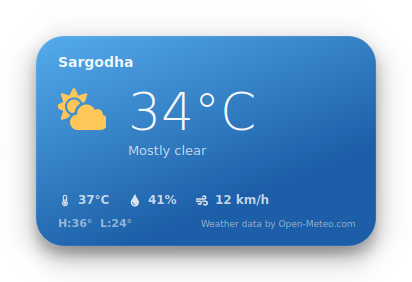
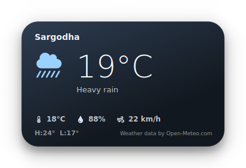

# Desktop Weather Widget

A single frameless, draggable weather card for the Windows desktop, styled
after iOS's home-screen weather widgets: a rounded card that shifts color
with the current condition and time of day, a large temperature numeral,
and a light stat row underneath. Corners are always rounded, whether the
card is showing its built-in gradient or a live photo background.

Location is detected automatically from your IP address by default, with
a manual override (see below). Weather data comes from
[Open-Meteo](https://open-meteo.com/), which is free and doesn't need an
API key.

<p>
  
  
</p>

*(Rendered directly from this codebase — the gradient and icon are driven
by the actual condition/time-of-day data, not two hand-designed skins.
This is the built-in gradient look; see "Background photos" below for the
photo mode — not pictured here since it needs photos only you can supply.)*

## Features

- Location: automatic IP-based detection, or a manual city/coordinates
  override (see *Fixing a wrong location* below)
- Live gradient background + icon that change with the weather condition
  and whether it's day or night, **or** your own local photos, **or**
  live Pexels photography (see *Background photos*) — rounded corners
  in every mode
- Current temperature, condition, feels-like, humidity, wind, today's
  high/low
- Drag anywhere on the card to reposition it — it remembers where you left it
- System tray icon (mirrors the current condition) with Show/Hide, Refresh,
  Quit
- Right-click the card itself for the same Refresh / Keep-on-top / Quit menu
- Auto-refreshes every 10 minutes; retries silently and keeps showing the
  last good reading if a refresh fails

## Requirements

- Windows 10 or 11 (uses Windows' DWM compositing for the rounded,
  translucent card — see *Troubleshooting* if it renders as a black box)
- Python 3.10+

## Setup

1. Double-click **`setup.bat`** (or run it from a terminal). This creates a
   `venv` folder and installs the three dependencies: `PySide6`,
   `qtawesome`, `requests`.
2. Double-click **`run.bat`** to start the widget. It launches with
   `pythonw`, so no console window appears.

If something goes wrong and the widget doesn't show up, run
**`run_debug.bat`** instead — it keeps a console window open with the
Python traceback.

## Fixing a wrong location

IP geolocation is only ever a guess at your city, and for towns outside
major metro areas it commonly resolves to the nearest big city instead
(that's a limitation of the IP-to-location databases themselves, not a bug
- no amount of retrying fixes it). `config.py` has an override, already
set up for Phularwan, Sargodha:

```python
MANUAL_LATITUDE = 32.18833
MANUAL_LONGITUDE = 73.02861
MANUAL_CITY_NAME = "Phularwan, Pakistan"
```

To move somewhere else later, either:
- look up the new place's coordinates and update the two numbers (most
  reliable), or
- set `MANUAL_LATITUDE`/`MANUAL_LONGITUDE` to `None` and just change
  `MANUAL_CITY_NAME` — it gets geocoded automatically on launch.

Clear all three (`None`, `None`, `""`) to go back to automatic IP-based
detection.

## Background photos — your own, local (default)

`config.BACKGROUND_SOURCE = "local"` by default: the card can show your
own photos instead of its built-in gradient, picked from folders already
set up for you:

```
backgrounds/
  Clear Day/
  Clear Night/
  Cloudy Day/
  Cloudy Night/
  Rainy Day/
  Rainy Night/
  Snowy Day/
  Snowy Night/
  Stormy Day/
  Stormy Night/
  Foggy Day/
  Foggy Night/
```

Just drop `.jpg` / `.jpeg` / `.png` / `.webp` / `.bmp` files straight into
whichever folders match — no filenames or metadata needed, and each folder
has a short `put your photos here.txt` note as a placeholder (delete it
whenever you like). **You don't need to fill in all twelve** — an empty
folder automatically falls back to a related, more general one (e.g. empty
*Stormy Night* → *Rainy Night* → *Cloudy Night* → *Clear Night*; the full
chain is `local_backgrounds.FALLBACK_CHAIN`), and if nothing has been
supplied anywhere yet the card just uses its gradient. The four you
mentioned - *Clear Day*, *Rainy Day*, *Clear Night*, *Rainy Night* - are
enough on their own to cover every condition through that fallback chain.

Behavior: the card fits whichever photo it picks to cover the rounded
card (cropping, never stretching) and lays a soft dark scrim underneath
the text so it stays legible regardless of the photo. It picks a new
photo from the current category once an hour, trying not to immediately
repeat the last one if you have more than one in that folder, and
switches immediately whenever the weather condition itself changes so
the photo never sits mismatched with what's actually happening outside.
No credit line is added for local photos (that's only shown for Pexels —
see below) since they're yours.

## Live photo backgrounds via Pexels (currently paused)

The widget can alternatively fetch real photography from Pexels
automatically instead of using local files. This is built but set aside
for now - switch to it anytime with two edits in `config.py`:

```python
BACKGROUND_SOURCE = "pexels"
PEXELS_API_KEY = "your-key-here"   # free at pexels.com/api, instant, no card
```

With that set, the card searches Pexels for a photo matching the current
condition and time of day (12 tunable queries in
`config.PEXELS_SEARCH_TERMS`), rotates hourly the same way local photos
do, and shows a small "Photo: &lt;photographer&gt; · Open-Meteo.com"
credit line linking to the photo's Pexels page (required by Pexels' API
terms). Its free tier is 200 requests/hour / 20,000/month - hourly
rotation uses roughly 24 requests a day, nowhere close to the limit.

Set `BACKGROUND_SOURCE = "off"` to always use the plain gradient
regardless of what's in `backgrounds/` or `PEXELS_API_KEY`.

## Customizing

Everything adjustable lives in `config.py`:

| Setting | What it does |
|---|---|
| `UNITS` | `"celsius"` or `"fahrenheit"` |
| `REFRESH_INTERVAL_MS` | How often to re-fetch weather |
| `ALWAYS_ON_TOP` | Pin the card above other windows by default (can also be toggled per-session from the right-click menu) |
| `CARD_WIDTH` / `CARD_HEIGHT` / `CORNER_RADIUS` | Card geometry |
| `MANUAL_LATITUDE` / `MANUAL_LONGITUDE` / `MANUAL_CITY_NAME` | Location override — see above |
| `BACKGROUND_SOURCE` | `"local"` (default), `"pexels"`, or `"off"` |
| `BACKGROUND_FOLDER_NAMES` / `BACKGROUND_ROTATE_INTERVAL_MS` | Local-photo folder names and rotation frequency |
| `PEXELS_API_KEY` / `PEXELS_SEARCH_TERMS` | Only used when `BACKGROUND_SOURCE = "pexels"` |
| `FALLBACK_LATITUDE/LONGITUDE/CITY_NAME` | Used only if every location method above fails |

Colors and gradients live in `styles.py` (`PALETTES` dict, one gradient per
condition/time-of-day pair) if you want to retint the non-photo look.

## How it works

- `weather_api.py` — resolves location (manual override, else geocoded
  manual city name, else IP-based via `ipwho.is`/`ip-api.com`), then calls
  Open-Meteo's `/v1/forecast` endpoint for current conditions + today's
  high/low.
- `local_backgrounds.py` — picks a random photo from `backgrounds/<Category>/`
  for the current condition, walking `FALLBACK_CHAIN` to a more general
  category if the specific folder is empty.
- `bg_images.py` — the paused Pexels path: searches for a photo matching
  the current condition/time-of-day and caches it to disk. Fully inert
  unless `BACKGROUND_SOURCE = "pexels"`.
- `workers.py` — runs weather fetches and photo lookups on separate
  `QThread`s so the UI never freezes on either; `BackgroundFetchWorker`
  dispatches to whichever of the two modules above `config.BACKGROUND_SOURCE`
  selects.
- `weather_codes.py` — maps Open-Meteo's WMO weather codes to a label, a
  [qtawesome](https://github.com/spyder-ide/qtawesome) icon glyph, and a
  palette key.
- `widgets/weather_card.py` — the frameless card itself: a custom-painted
  rounded surface (`QPainter` + `QPainterPath`, clipped so corners stay
  round for either the gradient or a photo), a legibility scrim over
  photos, a drop shadow, and drag-to-move / right-click handling.
- `main.py` — wires it together: the tray icon, the two refresh timers
  (weather + hourly photo rotation), and both workers' lifecycles.

## Notes & limitations

- **This is a single fixed-size widget** showing current conditions only —
  no hourly/multi-day forecast view, no in-app settings UI (everything is
  a `config.py` edit). Those would be natural next steps if you want them
  later.
- **Not "true" desktop-embedded** (i.e. it doesn't sit *behind* your desktop
  icons the way Rainmeter skins can) — it's a normal floating tool window
  with no taskbar entry. Embedding directly into the desktop layer requires
  Windows-version-specific `WorkerW` window tricks that are fragile across
  Windows updates, so this keeps it simple and robust instead.
- **Transparency needs DWM compositing** (on by default in Windows 10/11).
  If you've disabled desktop composition, the card will render as an
  opaque black rectangle instead of a translucent rounded card.
- Weather data is © [Open-Meteo.com](https://open-meteo.com/), CC BY 4.0 —
  the small credit line on the card is required by their license and
  shouldn't be removed if you redistribute this. Local background photos
  are your own, so no extra attribution is added for them; if you switch
  `BACKGROUND_SOURCE` to `"pexels"`, its required photographer credit
  line is added automatically.
